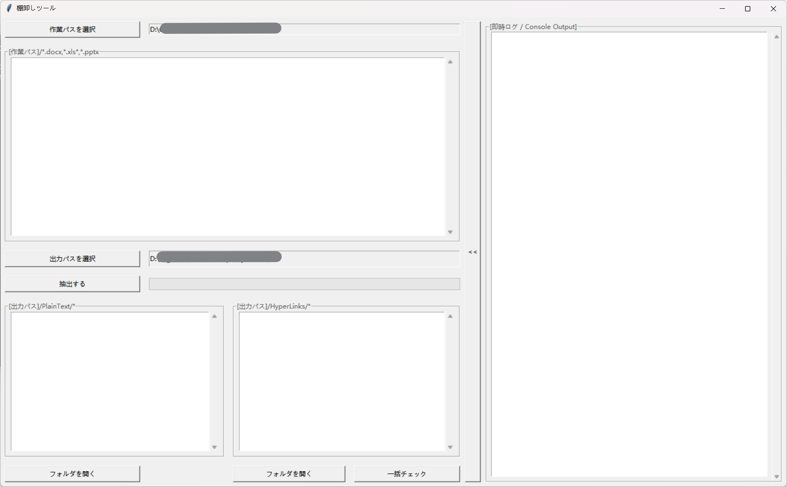
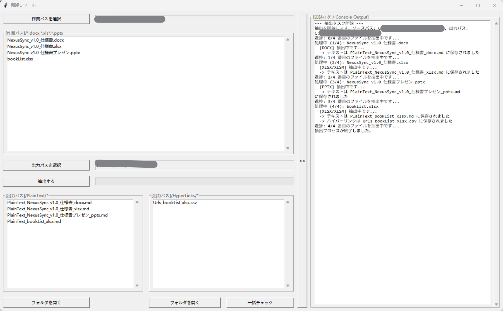
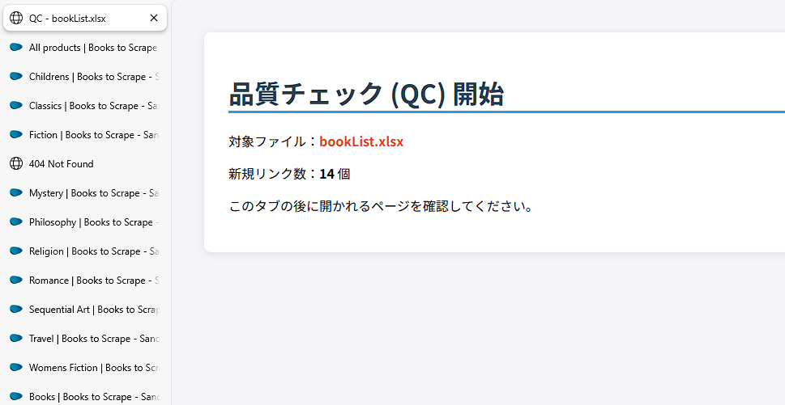
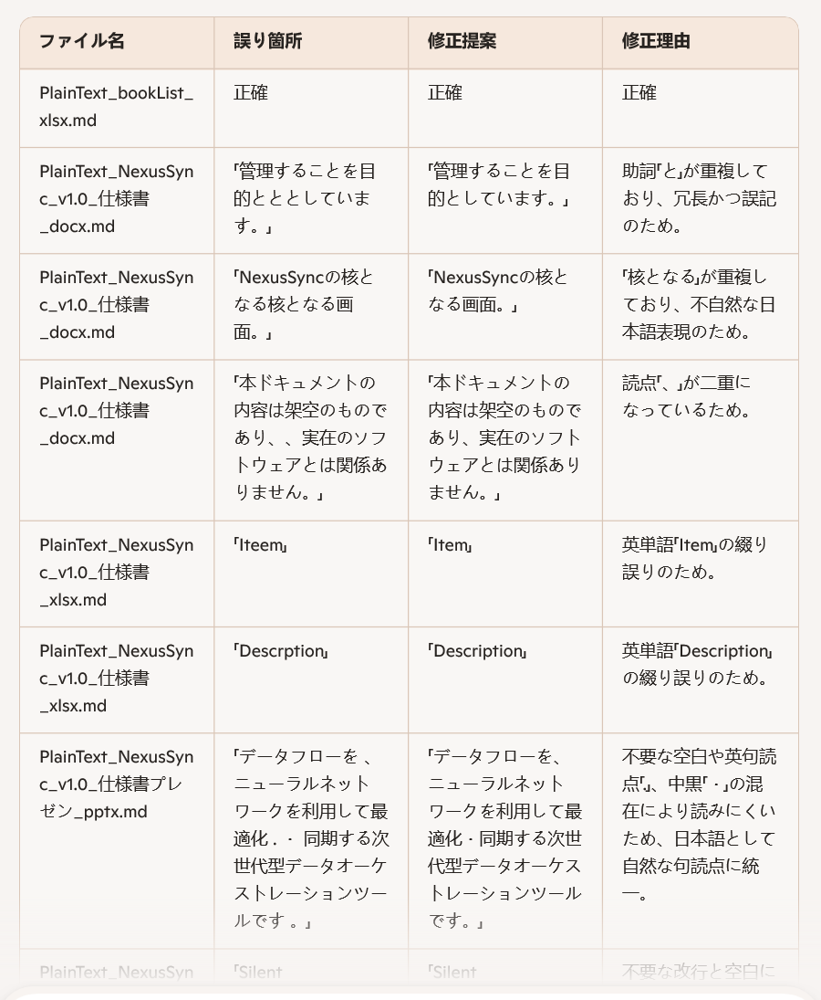

[](README.en.md)
[](README.zh-CN.md)
[](README.md)

----

# プロジェクト分析：Officeファイル品質チェックツール

## 使用イメージ
1. **シンプルな操作インターフェース**

    

    処理対象のフォルダと出力先を選択するだけのシンプルな設計です。Tkinterベースの軽量なUIで、誰でも 迷わず操作を開始できます。

2. **リアルタイム・テキスト抽出とログ表示**

    

    実行中は、各ファイルからのテキスト抽出状況がリアルタイムでログウィンドウに表示されます。処理が正常に完了したか、どのファイルが処理中かを即座に把握できます。

1. **ハイパーリンクの一括抽出と重複チェック**

    

    ドキュメント内のURLを網羅的に抽出し、リスト化します。独自の重複排除ロジックにより、大量のファイルから共通の参照先を整理し、ブラウザでの一括確認をスムーズにします。

    
1. **AIを活用した品質チェック (LLM Integration)**

    [抽出されたテキストをAIで解析するためのプロンプトはこちら](./prompt/QC-prompt.md)

    
    
    抽出されたMarkdown形式のテキストを、CopilotなどのLLMに投入することで、誤字脱字、表現の揺れ、矛盾点の指摘など、高度な校正支援を受けることができます。

## プロジェクト概要
このプロジェクトは、Officeドキュメント（具体的には `.docx`、`.xlsx`、`.xlsm`、`.pptx` ファイル）からコンテンツを抽出するために設計された、PythonベースのGUIアプリケーションです。ユーザーインターフェースにはTkinterを、ドキュメントの解析には専用のPythonライブラリを使用しています。

**主な機能：**

* **テキスト抽出：** Officeドキュメントからプレーンテキストを抽出し、Markdown（`.md`）ファイルとして保存します。これらは、ユーザーが指定した出力パス内のタイムスタンプ付きディレクトリ（例：`PlainText_YYYYMMDDHHMMSS`）に整理されます。
* **ハイパーリンク抽出：** Officeドキュメントからハイパーリンクを抽出し、特定のヘッダーと拡張子を持つ `.csv` ファイルとして保存します。これらは、タイムスタンプ付きの `HyperLinks_YYYYMMDDHHMMSS` ディレクトリに整理されます。
* **URLの一括展開：** 抽出された `.csv` ファイルからすべてのハイパーリンクを開く機能を提供します。この機能には強力なグローバル重複排除ロジックが含まれており、処理されたすべてのドキュメント全体で、各ユニークURLが一度だけ開かれるように制御されます。URLを開く前に、プロセスの概要をまとめた情報HTMLページが生成され、既定のブラウザで表示されます。

**主要技術：**

* **言語：** Python
* **GUIフレームワーク：** Tkinter
* **ドキュメント解析ライブラリ：** `python-docx`, `openpyxl`, `python-pptx`
* **その他のライブラリ：** `csv`, `os`, `sys`, `threading`, `webbrowser`, `datetime`

**アーキテクチャ：**

* **GUIレイヤー：** `gui.py` - ユーザーインタラクション、ウィンドウ管理、イベントバインディング、および進捗表示を担当します。
* **コアロジックレイヤー：** `core/` ディレクトリに以下が含まれます：
* `extractor.py`: Officeファイルの解析、テキストおよびハイパーリンクの抽出ロジックを実装しています。
* `url_opener.py`: `.csv` ファイルの読み込み、URLの重複排除、およびブラウザでのURL展開を管理します。

## ビルドと実行方法

**1. 依存関係のインストール：**

プロジェクト環境をセットアップし、必要なすべてのPythonパッケージをインストールするには、ターミナルで以下のコマンドを実行してください。

```bash
pip install -r requirements.txt
```

**2. アプリケーションの実行：**

GUIアプリケーションを起動するには、メインスクリプトを実行します。

```bash
python gui.py
```

これによりグラフィカルユーザーインターフェースが開き、入力・出力ディレクトリの選択および抽出プロセスの開始が可能になります。

## 開発規約

* **コード構成：** 関心事の分離（Separation of Concerns）を明確にし、コアビジネスロジックを `core/` ディレクトリに、ユーザーインターフェースを `gui.py` に配置しています。
* **コメントとドキュメント：** コード内には、関数、クラス、および特定のロジックブロックの目的を説明する詳細なコメント（主に日本語）が含まれています。メソッドにはドキュメント文字列（Docstrings）が使用されています。
* **エラーハンドリング：** ファイル操作、ライブラリのインポート、データ処理において、`try-except` ブロックを用いた堅牢なエラーハンドリングが実装されています。ユーザー向けのエラーはTkinterの `messagebox` を通じて通知され、詳細はコンソール/ログウィンドウ（`sys.stderr`）に出力されます。
* **ユーザーフィードバック：** プログレスバー（`ttk.Progressbar`）による視覚的なフィードバックと、`stdout` および `stderr` の出力をキャプチャする専用のログエリアがGUIに備わっています。
* **非同期処理：** 時間のかかる抽出タスクには `threading.Thread` を使用し、GUIのフリーズを防ぎ、レスポンシブなユーザー体験を確保しています。
* **ファイル命名規則：** 抽出されたファイルは一貫した命名規則に従います。
* **テキスト：** `PlainText_[元のファイル名]_[元の拡張子].md`（例：`PlainText_Report_docx.md`）
* **ハイパーリンク：** `Urls_[元のファイル名]_[元の拡張子].csv`（例：`Urls_Report_docx.csv`）
* 出力ディレクトリにはタイムスタンプが付与されます（例：`PlainText_20251227103000`）。


* **URL重複排除：** `url_opener.py` モジュールは、冗長な操作を避けるため、ファイル内およびグローバルでのURL重複排除を実装しています。